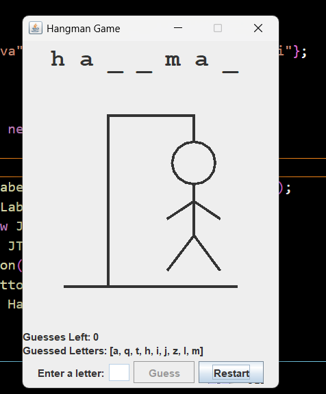

# Hangman-Game-in-Java
# 🕹️ Hangman Game - Java Swing Edition

A classic **Hangman game** implemented using **Java Swing GUI**, featuring:

- 🧠 Random word generation
- ✏️ Letter guessing with duplicate check
- 🧍 Visual hangman drawing with each wrong guess
- 📜 Display of guessed letters
- 🔁 Restart button for new games

---

## 🎮 Gameplay Preview

  
*(Add your own screenshot image to the repo for better visibility)*

---

## 🧩 Features

- ✅ Java Swing-based GUI
- ✅ Letter-by-letter guessing
- ✅ Case-insensitive input
- ✅ Error tracking with visual feedback (hangman drawing)
- ✅ Duplicate-guess detection and prevention
- ✅ Restart functionality without closing the app

---

## 🚀 Getting Started

### Prerequisites

- Java Development Kit (JDK) 8 or higher

### Run the Game

```bash
javac HangmanGame.java
java HangmanGame

